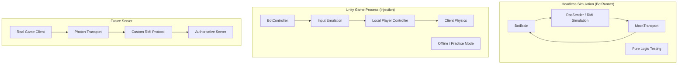

# UberStrike 4.3 Architecture & Bot Implementation

## 1. UberStrike 4.3 Actual Architecture

Based on extensive reverse engineering and analysis, the UberStrike 4.3 architecture differs significantly from typical Unity multiplayer games of its era.

### Network Topology
*   **Transport Layer**: Uses Photon as a raw transport layer (UDP/TCP).
*   **Protocol**: Custom Remote Method Invocation (RMI) protocol built on top of Photon, not standard Photon Unity Networking (PUN) RPCs.
*   **Server Model**: Strictly authoritative. Game logic (hit registration, movement validation, spawning) runs on the server.
*   **Missing Components**: The server-side logic is proprietary and not available in public repositories. We only have the client.

### Client-Side Reality
*   **Input**: The client sends input states and requests to the server.
*   **State**: The client receives authoritative state snapshots from the server.
*   **Prediction**: The client performs local prediction for movement to ensure smooth gameplay, but this is corrected by server updates.

## 2. Our Approach

Given the lack of server source code and the requirement to run bots, we have adopted a multi-faceted strategy.

### Component 1: Headless Simulation (BotRunner)
**Objective**: A standalone C# application to develop and test bot AI logic deterministically without running the full game client.

*   **Role**: Simulates the **Logical RMI Interface** of the game.
*   **Mechanism**: Uses `RpcMapping` to translate bot actions into network events, simulating the inputs the server would receive.
*   **Protocol Accuracy**: Simulates the *structure* of the Custom RMI protocol (via `SendOperation` abstractions) but currently uses placeholder OpCodes for testing AI behaviors.
*   **Benefit**: Allows rapid iteration of AI behaviors (aiming, pathing, decision making) in a controlled environment.

### Component 2: Client-Side Bots (Injection)
**Objective**: Run the developed bot logic within the official game client in Offline/Practice modes.

*   **Execution Environment**: Inside the Unity Engine (via DLL injection).
*   **Mechanism**: Bypasses the network layer entirely. It directly manipulates Unity components and inputs.
*   **Role**: The "Body" for the bot logic, executing commands in the real game engine.

### Phase 3: Server Emulation (Future)
**Objective**: Recreate the server logic to host custom games.

*   **Server Emulator**: A standalone application implementing the UberStrike Custom RMI protocol.
*   **Status**: Requires reverse-engineering the exact OpCodes and payload structures (see `docs/Protocol-Analysis/`).

## 3. Technical Constraints

*   **Unity Version**: The game was built with **Unity 2017.4.40f1**. Any injected code or asset bundles must be compatible with this version.
*   **Runtime**: The game runs on **.NET 3.5**. Modern C# features (Task, async/await) are not natively available and must be avoided or polyfilled.
*   **Injection**: We use `Reflection` to find game objects and managers at runtime because we cannot link against the game's private assemblies at compile time easily.
*   **Source Code**: We have NO access to the original server source code. All server logic must be inferred from client-side traces and decompilation.

## 4. Component Diagram

## References

*   **Analysis**: See `docs/UberStrike-Network-Analysis.pdf` (Placeholder) for packet captures.
*   **Decompilation**: `Assembly-CSharp.dll` from the game client is the primary source of truth.
